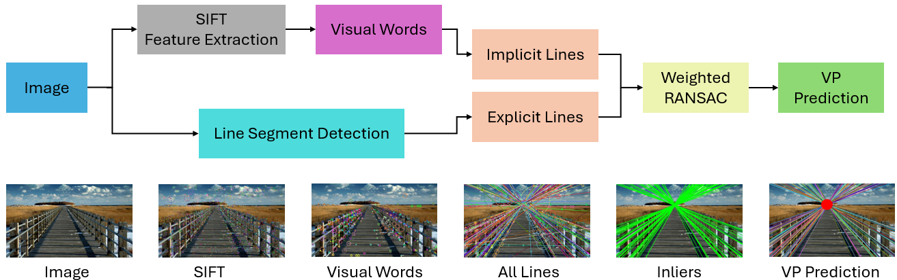
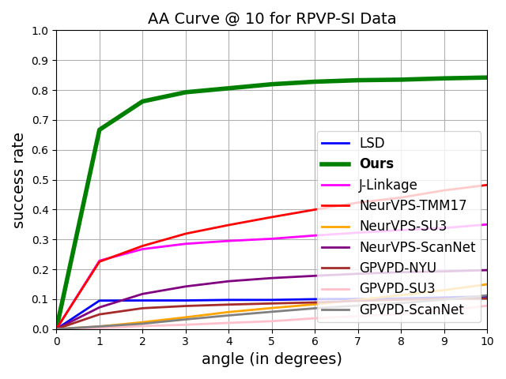
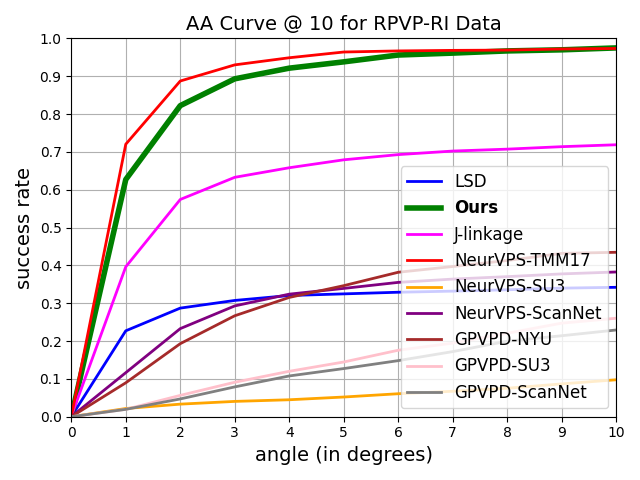
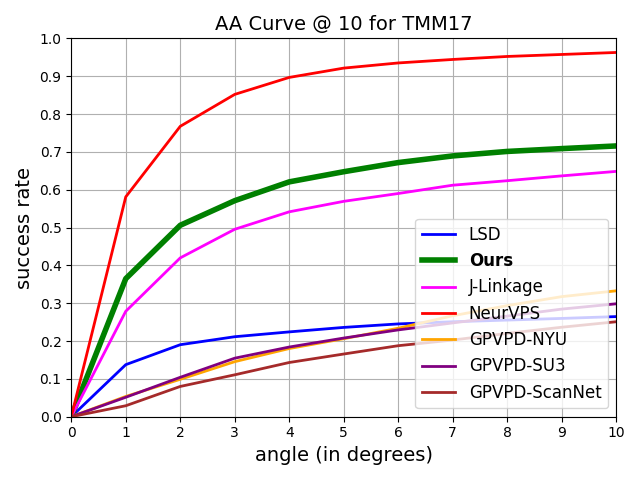

# RVPD: Recurrence-based Vanishing Point Detection
This repository contains the official implementation of the paper: [Skanda Bharadwaj](https://www.skandabharadwaj.com/), [Robert T. Collins](https://www.cse.psu.edu/~rtc12/) and [Yanxi Liu](https://www.cse.psu.edu/~yul11/), "Recurrence-based Vanishing Point Detection", WACV 2025.

## Introduction
Classical approaches to Vanishing Point Detection rely solely on the presence of explicit straight lines in images. In this paper, we propose an alternative novel unsupervised approach: Recurrence-based Vanishing Point Detection, that uses implicit lines derived from discovered recurrences in addition to explicit lines. Furthermore, we contribute two new VPD datasets: 1. a Synthetic Image dataset with 3,200 ground truth vanishing points, and 2. a Real-World Image dataset with 1,400 human annotated vanishing points. We establish VPD benchmarks quantitatively and qualitatively by comparing with different VPD algorithms including deep learning methods and classical methods.

 


## Main Results
| RPVP-SI Dataset                                              | RPVP-SI Dataset                                              | TMM17 Dataset                       | 
| ------------------------------------------------------------ | ------------------------------------------------------------ | ----------------------------------- |
|                                  |                                  |             |

Here, the x-axis represents the angle accuracy of the detected vanishing points and the y-axis represents the percentage of the results with error less than that.

### Code Structure

A quick overview of the code structure.

```bash
########################### Data ###########################
images/                     # default folder for input images
results/                    # default folder for outputs
    anno/                   # predicted VP coordinates files
    imgs/                   # predicted VP images

########################### Code ###########################
Header/
    fileManage.h            # general includes file
    functions.h             # helper functions file
    general_include.h       # general includes file
    hierarchical_cluster.h  # heirarchical clustering class with respective functions
    visual_word.h           # visual words class with respective functions
    vp_compute.h            # Computation of VP based on discovered lines
    vp_Ransac.h             # Ransac class with respective functions

Source/
    detect.cpp              # entry point file with the definition of main. Caller File.

CMakeLists.txt              # CMake file to define paths to libraries.

README.md                   # ReadMe file

############################################################
```
## Compile the Cpp Module

### Prerequisites (Cpp module)
- OpenCV == 3.4.11 (*recommended*), 
- Boost == 1.74 (*recommended*), 
- cmake >= 2.8

### On Windows OS
- Open cmake-gui
- Set source directory to be `path/to/your/code/RVPD_WACV25/`
- Set build directory to be `path/to/your/code/RVPD_WACV25/build`
- Open `path/to/your/code/RVPD_WACV25/CmakeList.txt`, uncomment line 9: `set(OpenCV_DIR "D:/OpenCV/OpenCV 3.4.11/opencv/build")` if you do not have OpenCV path in your environment, and modify it to your own OpenCV directory.
- Uncomment line 14, 15 for Boost path similarly if needed.
- Press Configure until no more red entries
- Press Generate to generate the project
- Open the project and compile it in Release Mode (*recommended*) to get the corresponding executable file.

### On Linux or Mac
- Modify the CmakeList file as well if needed.
- Run the following commands in terminal:
	```	
	cd path/to/your/code/RVPD_WACV25
	mkdir build && cd build
	cmake ..
	make -j4
	```

### OpenCV installation on Ubuntu
Follow the webpage: `https://learnopencv.com/install-opencv-3-4-4-on-ubuntu-16-04/` <br>
RVPD_WACV25 can run on `OpenCV-3.4.18`. This has been tested. `3.4.11` is not as reliable as `3.4.18` <br>
Based on the aforementioned webpage, consider the following cmake prefix
```
cmake -D CMAKE_BUILD_TYPE=RELEASE \
            -D CMAKE_INSTALL_PREFIX=$cwd/installation/OpenCV-"$cvVersion" \
            -D INSTALL_C_EXAMPLES=ON \
            -D INSTALL_PYTHON_EXAMPLES=ON \
            -D WITH_TBB=OFF \
            -D WITH_V4L=ON \
            -D WITH_FFMPEG=OFF \
            -D OPENCV_PYTHON3_INSTALL_PATH=$cwd/OpenCV-$cvVersion-py3/lib/python3.5/site-packages \
        -D WITH_QT=ON \
        -D WITH_OPENGL=ON \
        -D OPENCV_EXTRA_MODULES_PATH=../../opencv_contrib/modules \
        -D BUILD_EXAMPLES=ON ..`
```

## Running the Code
Once the project is built successfully, run the project by running the executable in the `build` folder. <br> 
It is highly recommended to use `VS Code` for ease. <br>

Place the input images in the `images/` folder of the project. <br>
The results are dumped in the `results/` folder of the project. <br>

## Troubleshooting
Note that `Tbb` and `FFMPEG` are `OFF`: `-D WITH_TBB=OFF \ -D WITH_FFMPEG=OFF \` <br>
If `QT` happens to throw errors when building opencv consider switching off `QT` or <br>
try `apt-get install qtbase5-dev` and `apt-get install qtdeclarative5-dev`


